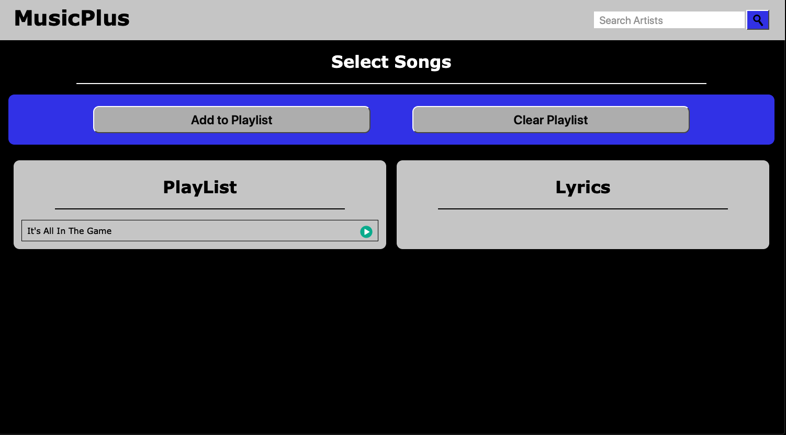
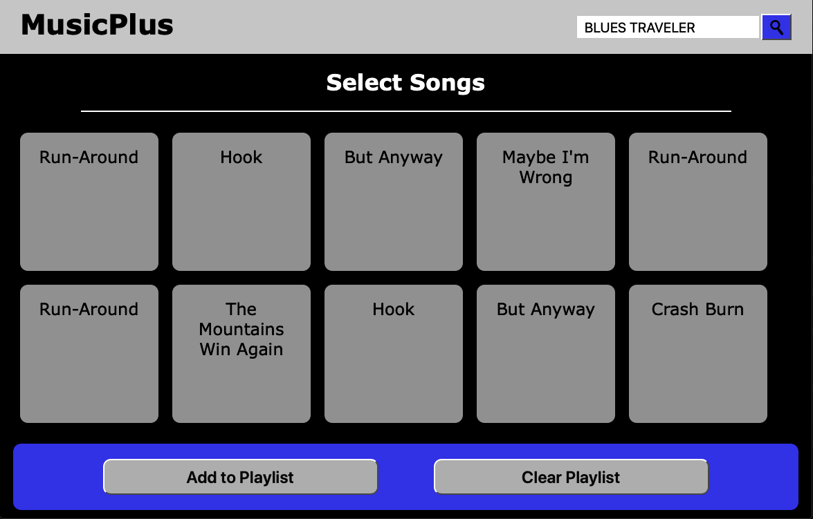
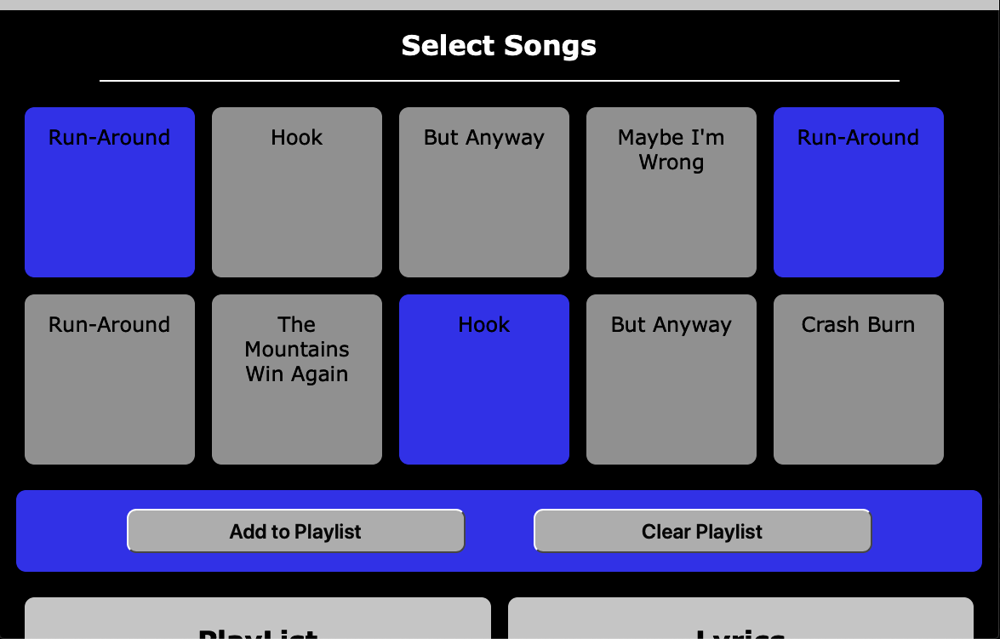
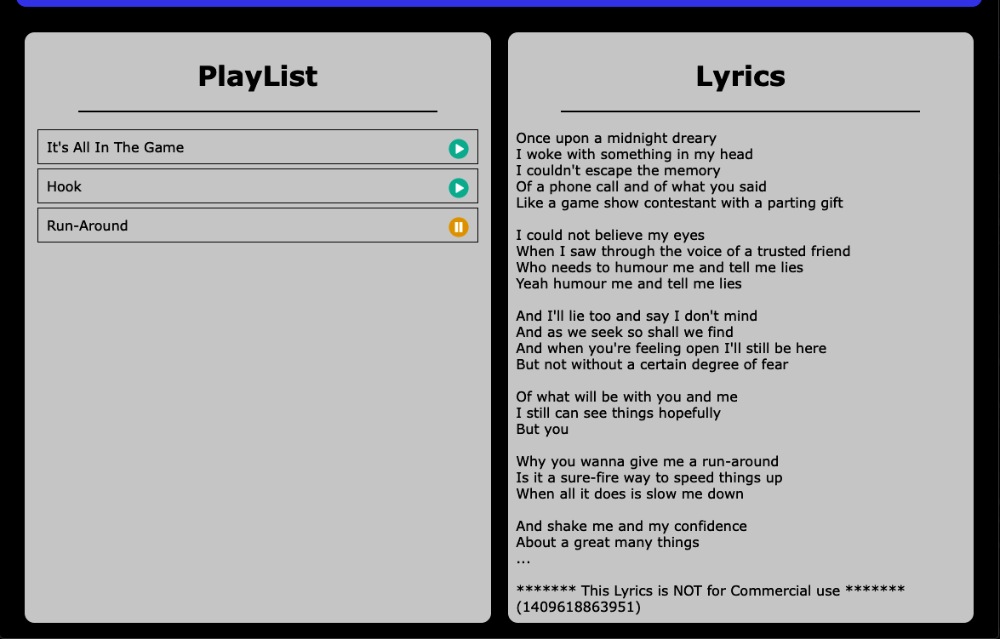

# musicBrief

*   README
*   MusicBrief
*   Version: 1.0.0
*   Development By Kelsie Langston, Josh Faison, and Tripp Parham
*   Published: Saturday January 4th 2020

## Description
As a music lover, you might wish you had a free and easy place to search music from your favorite artist or find lyrics to your favorite songs.  MusicPlus is a place where you can do just that. Easily search for artist or title names. Play a sample of the track, and sing along to lyrics of your favorite songs.  You can also create a list of favorite track samples.  This app uses a HTML, CSS, ,Bootstrap, JavaScript, Jquery, server-side API, and responsive web design.
## Visuals

## Installation

### Goto the following link to use MusicPlus:

    https://wilpar4813.github.io/musicPlus/

### The code is located in GitHub at the following link:

    https://github.com/wilpar4813/musicPlus

## Usage
* From the home screen, search for any artist by typing the artist's name in the search box in the top right of the screen.
* A list of songs by the chosen artist is presented. Click desired songs, and then click add to playlist.
* The playlist is stored in local storage and can be cleared by clicking the Clear Storage button.
* Each song can be played by clicking the play symbol to the right of the song name in the playlist.
* Once a song is selected or it is played from the playlist, the lyrics are displayed in the lyrics box in the bottom right of the webpage.

## File Structure

* README.md (Read for information on site development)
* FORME.md (Development use only)
* index.html
    * script.js
    * lyrix.js
* assets folder
    * img folder
        * searchIcon.png
* develop folder
    * flexboxgrid.min.css
    * style.css

## Support
### Contact: Tripp Parham 
### email: tripp.parham@me.com

## Known bugs[0]

## Troubleshooting[5]
* The correct songs are displayed when artist is entered.
* If the artist is not in the database a message is displayed.
* When a song is selected, it is correctly added to the playlist.
* The playlist correctly clears when the Clear Playlist button is clicked.
* Lyrics correctly display when song is selected from song list or playlist

# Credits and acknowledgments
### Special thanks to the Instructors and Staff at the UNC Coding Bootcamp. They are an awesome team.:-) I recommnend Trilogy to anyone that wants to learn Javascript Web Development. They have a fine tuned program and lots of great resources.

## Licensing
* All lyrics and songs are Copyright protected and it is illegal to use them for commercial use.
* Copyright MusixMatch.com

    https://developer.musixmatch.com/
    https://playground.musixmatch.com/#/Subtitle

* Search icon by:
    https://www.iconsdb.com/black-icons/search-13-icon.html

## Versions
Verion 1.0.0 Released Saturday January 4th, 2020

